# ПРОДАКШН-БИБЛИЯ И РЕЖИССЁРСКАЯ РАСКАДРОВКА
## Проект: **«SUBWAY PROPHETS — ПОСЛЕДНИЙ ВАГОН ДО РАССВЕТА» (LAST CAR TIL DAWN)**

| Параметр проекта | Спецификация |
| :--- | :--- |
| **Жанр / Эстетика** | Олдскул Хип-Хоп 90-х (1994 Golden Era Boom-Bap / Street Art / Подземка) |
| **Формат** | Музыкальный клип / Анимационный короткометражный фильм |
| **Хронометраж и Темп** | `03:20` • **92 BPM** (размер 4/4, свинговая квантизация 62% на Akai MPC3000) |
| **Оптика и Формат кадра** | **2.39:1 Anamorphic Widescreen** + вставки **4:3 (16mm Fisheye)** для речитатива |
| **Плёнка / Текстура** | Эмуляция **Kodak Vision 500T 5279** (тёплое зерно 35 мм, халляция в светах, глубокий чёрный) |
| **Референсы визуала** | *Nas — It Ain't Hard to Tell (1994)*, *Wu-Tang Clan — C.R.E.A.M.*, *Style Wars (1983)*, концепт-арт 90s Street Culture |

---

## 1. ЛОГЛАЙН И КОНЦЕПЦИЯ СЮЖЕТА

**Логлайн:**  
Четыре уличных артиста из команды **«Subway Prophets»** — лирик-философ **Kilo-Watt**, звуковой алхимик **DJ Rusty Needle**, бесстрашная граффити-райтерша **Nova** и взрывной би-бой **Gravity** — объединяют четыре стихии хип-хопа в одну бессонную ночь 1994 года. Пока мегаполис спит, они сэмплируют живой грохот подземки, собирают качающий бит в котельной, проникают в закрытое депо метро под носом у охраны и превращают серый стальной состав в яркий манифест свободы, который на рассвете пронесётся над просыпающимся городом.

**Драматургическая структура (4 столпа хип-хопа):**
1. **DJing / Beatmaking (Звук):** Ловля индустриального шума города и превращение его в ритм.
2. **MCing (Слово):** Голос улиц, превращающий бетонную тоску в острую поэзию.
3. **Graffiti Writing (Образ):** Захват серого городского пространства цветом и дерзким стилем.
4. **B-Boying (Движение):** Победа человеческой энергии над гравитацией и серыми буднями.

---

## 2. БИБЛИЯ ПЕРСОНАЖЕЙ (CHARACTER SHEETS & DESIGN SPECS)

Каждый из четырёх героев спроектирован по правилу **контраста базовых геометрических силуэтов** (Треугольник, Квадрат, Асимметричная Трапеция, Динамический Ромб) — это гарантирует мгновенную считываемость персонажей даже в контровом свете, силуэте и тумане.

---

### ПЕРСОНАЖ №1: MC KILO-WATT (Маркус «Киловатт» Вэнс)
> **Роль в команде:** Главный MC, поэт-урбанист и тактический лидер  
> **Стихия:** *Слово (MCing / Lyricism)* • **Возраст:** 21 год

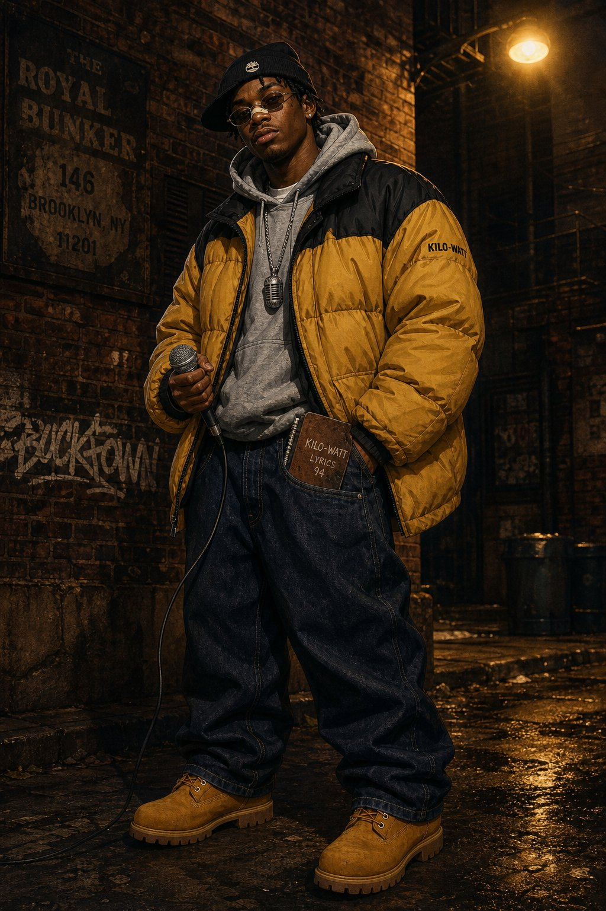

#### Визуальный и конструктивный разбор (Character Turnaround Guide)
* **Геометрия силуэта:** **Перевёрнутый треугольник / трапеция** за счёт массивного дутого пуховика сверху и широких джинсов со складками («stacks») у ботинок. Рост — 186 см (самый высокий в команде).
* **Гардероб и фактуры:**
  * **Верхний слой:** Объёмный двухцветный пуховик *First Down / Tommy style* (горчично-золотой верх `#D99B26` с матово-чёрными плечами `#18181B`), плотный рипстоп-нейлон с мягким блеском в свете уличных фонарей.
  * **Средний слой:** Плотная серая меланжевая худи *Champion Reverse Weave* (`#7A7D82`), капюшон выправлен поверх воротника.
  * **Низ и обувь:** Свободные тёмно-синие джинсы из сырого денима (`#1C2838`) с низкой посадкой; культовые 6-дюймовые нубуковые ботинки *Timberland* пшеничного цвета (`#C68E3F`) со слегка расшнурованным верхом.
  * **Детали лица и аксессуары:** Чёрная шапка-бини (*skully*), сдвинутая набок поверх коротких твистов; узкие овальные очки в тонкой золотой оправе; белый медицинский пластырь на переносице; массивная серебряная цепь с кулоном в виде классического микрофона *Shure SM58*.
* **Ключевой реквизит (Hero Props):**
  1. Проводной динамический микрофон с хромированной сеткой и обмотанным чёрной изолентой XLR-шнуром.
  2. Потрёпанный кожаный блокнот `KILO-WATT LYRICS '94`, торчащий из переднего кармана джинсов.
* **Пластика, мимика и походка:**
  * Двигается размеренно, с широким «бруклинским» шагом и лёгким наклоном корпуса вперёд.
  * Во время читки рубит воздух левой ладонью строго в сильные доли (2-я и 4-я четверти такта). Взгляд спокойный, чуть прищуренный сквозь очки, но в момент панчлайна брови резко сходятся, а подача становится взрывной.

---

### ПЕРСОНАЖ №2: DJ RUSTY NEEDLE (Дарио «Ржавая Игла» Моралес)
> **Роль в команде:** Битмейкер, сэмплер-инженер и тёрнтейблист  
> **Стихия:** *Ритм и Звук (DJing & Production)* • **Возраст:** 23 года

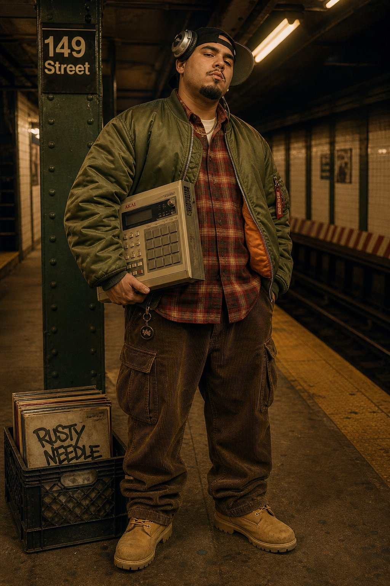

#### Визуальный и конструктивный разбор (Character Turnaround Guide)
* **Геометрия силуэта:** **Монолитный квадрат / скруглённый прямоугольник**. Коренастый, плотный, невозмутимый, с низким центром тяжести. Рост — 174 см.
* **Гардероб и фактуры:**
  * **Верхний слой:** Винтажный лётный бомбер *Alpha Industries MA-1* оливкового цвета (`#4A5535`) с ярко-оранжевой шёлковой подкладкой (`#E05A2B`) и карманом-пеналом на левом рукаве.
  * **Средний слой:** Фланелевая рубашка в красно-чёрно-бежевую шотландскую клетку (`#8C2D26`), расстёгнутая поверх белой базовой футболки и золотой цепочки.
  * **Низ и обувь:** Широкие вельветовые карго-брюки землисто-коричневого оттенка (`#4E3B2B`) с объёмными боковыми карманами (в них лежат кассеты TDK SA-90 и переходники Jack 6.3 мм).
  * **Детали лица и аксессуары:** Чёрная кепка, надетая козырьком назад; поверх неё — винтажные серебристые мониторные наушники *Technics RP-DJ1200* (правая чашка прижата к уху, левая сдвинута на висок); аккуратная эспаньолка и неизменная деревянная зубочистка в уголке рта.
* **Ключевой реквизит (Hero Props):**
  1. Легендарный сэмплер-секвенсор **Akai MPC3000** в кастомном дорожном кейсе.
  2. Полевой кассетный рекордер *Sony Walkman Professional WM-D6C* с узконаправленным репортёрским микрофоном.
  3. Чёрный пластиковый молочный ящик (*milk crate*), доверху набитый редкими пластинками джаза и соула 70-х.
* **Пластика, мимика и походка:**
  * Минимум лишних движений телом — вся энергия сосредоточена в пальцах (виртуозный *finger drumming* на 16 резиновых пэдах MPC) и глубоком гипнотическом кивке головой (*head nod*) в темпе 92 BPM.

---

### ПЕРСОНАЖ №3: NOVA (Рокси «Нова» Чен-Сантьяго)
> **Роль в команде:** Граффити-райтер (All-City Bomber) и визуальный архитектор  
> **Стихия:** *Уличное искусство (Graffiti Writing)* • **Возраст:** 19 лет

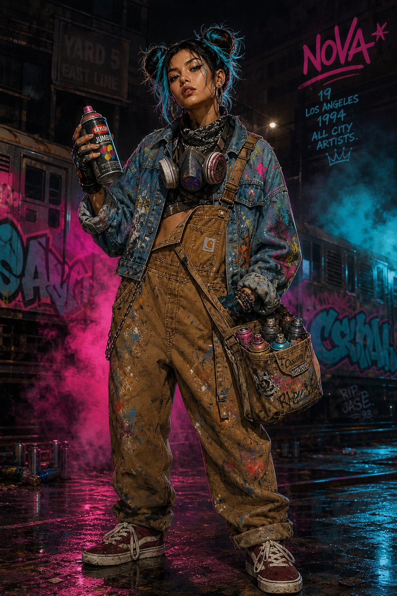

#### Визуальный и конструктивный разбор (Character Turnaround Guide)
* **Геометрия силуэта:** **Динамическая асимметричная трапеция** с акцентом на два высоких пучка волос и массивную сумку с баллонами на бедре. Рост — 168 см.
* **Гардероб и фактуры:**
  * **Верхний слой:** Укороченная оверсайз-джинсовка (`#3B5978`), густо покрытая многослойными брызгами акрила, подтёками мадженты и циана.
  * **Основной слой:** Рабочий брезентовый комбинезон *Carhartt Duck Bib* цвета охры (`#B87D3B`); правая лямка небрежно отстёгнута и свисает вдоль бедра, открывая укороченный чёрный топ.
  * **Детали и защита:** Профессиональный полумасочный респиратор *3M* с двумя сменными угольными фильтрами в розовых корпусах (`#D92B6B`), висящий на шее поверх чёрно-белой банданы с узором пейсли; кожаные перчатки без пальцев, испачканные краской; крупные серьги-кольца (*hoop earrings*).
  * **Причёска и обувь:** Чёрные волосы с яркими кислотно-бирюзовыми прядями (`#00C2E0`), собранные в два небрежных высоких пучка; бордовые замшевые кеды с широкими белыми шнурками (*fat laces*).
* **Ключевой реквизит (Hero Props):**
  1. Брезентовая сумка почтальона, набитая аэрозольными баллонами *Krylon* и *Rust-Oleum* с комплектом сменных насадок (*Astro Fat Cap*, *NY Fat*, *Skinny Cap*).
  2. Самодельный маркер-сквизер (*mop*) с длинными живописными потёками.
* **Пластика, мимика и походка:**
  * Хищная, пружинистая кошачья пластика; постоянно сканирует пространство на предмет патрулей охраны.
  * При работе с баллоном работает всем корпусом — от широких махов плечом на заливке (*fill-in*) до хирургически точных движений кистью на бликах (*3D highlights*).

---

### ПЕРСОНАЖ №4: B-BOY GRAVITY (Тайрон «Грэвити» Джексон)
> **Роль в команде:** Би-бой (Powermove & Freeze Master), живой аккумулятор энергии  
> **Стихия:** *Танец (B-Boying / Breaking)* • **Возраст:** 20 лет

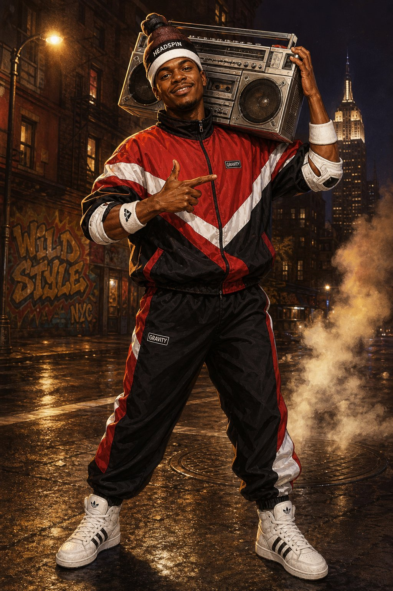

#### Визуальный и конструктивный разбор (Character Turnaround Guide)
* **Геометрия силуэта:** **Атлетический ромб / молния** — широкие плечи, графичные шевронные линии спортивной олимпийки, сходящиеся к центру груди, создающие оптический эффект вращения при пируэтах. Рост — 178 см.
* **Гардероб и фактуры:**
  * **Костюм:** Винтажный нейлоновый спортивный костюм (*windbreaker tracksuit*) в агрессивной красно-бело-чёрной гамме (`#D62828` / `#F8F9FA` / `#141414`) — шуршащий глянцевый крэш-нейлон, который эффектно ловит блики при резких остановках (*freezes*).
  * **Защита и аксессуары:** Вязаная шапка для кручения на голове (*Headspin Beanie*) с усиленной скользящей вставкой поверх белой махровой повязки (*sweatband*); белые эластичные суппорты на локтях и запястьях.
  * **Обувь:** Высокие белоснежные кожаные кроссовки *Adidas Forum / Artillery Hi* с чёрными полосками и толстой подошвой.
* **Ключевой реквизит (Hero Props):**
  1. Огромный двухкассетный хромированный бумбокс *Lasonic TRC-931 / JVC* на плече (`#A8B2BC`).
  2. Свёрнутый лист плотного картона / линолеума для уличного танцпола.
* **Пластика, мимика и походка:**
  * Не умеет стоять неподвижно: даже в покое переступает в ритме *toprock* или делает изолированные волны плечами (*popping*).
  * Главная фишка в кадре — переход из сверхскоростного вращения (*windmill / headspin*) в абсолютно каменный однорукий *airchair freeze* точно на удар снейра.

---

## 3. ЦВЕТОВАЯ ПАЛИТРА И ОПЕРАТОРСКАЯ КОНЦЕПЦИЯ (COLOR SCRIPT)

Визуальная драматургия клипа строится на столкновении **индустриального ночного города** и **взрывной палитры героев**:

| Слой кадра | Цветовой код (HEX) | Назначение в кадре |
| :--- | :--- | :--- |
| **Asphalt Night (Фон)** | `#0E1015` | Глубокие тени подземки, чугунные конструкции, ночное небо |
| **Sodium Vapor (Ключевой свет)** | `#E59B27` | Тёплый янтарный свет уличных натриевых ламп и фар поезда (3200K) |
| **Subway Steel (Средний тон)** | `#7A8494` | Рифлёный нержавеющий металл вагонов метро и влажные рельсы |
| **Kilo-Watt Mustard** | `#D99B26` | Силуэт главного MC — перекликается с янтарным светом города |
| **Rusty Olive & Orange** | `#4A5535` / `#E05A2B` | Приземлённая, тёплая аналоговая палитра битмейкера |
| **Nova Aerosol Cyan & Magenta** | `#00C2E0` / `#E0246A` | Визуальный взрыв граффити, прорезающий тёмную индустриальную среду |
| **Gravity Kinetic Crimson** | `#D62828` | Динамический красный акцент в центре кадра во время танца |

---

## 4. ПОКАДРОВАЯ РЕЖИССЁРСКАЯ РАСКАДРОВКА (MASTER STORYBOARD)

Ниже представлена детальная раскадровка всех **8 ключевых сцен** музыкального видео (хронометраж `00:00 – 03:20`).

---

### КАДР 01 // ИНТРО: ОХОТА ЗА ЗВУКОМ (SUBWAY SOUND HUNT)
* **Таймкод:** `00:00 – 00:18` (18 сек) • **Локация:** Платформа 145th Street, ночной интервал / закрытая съёмочная площадка

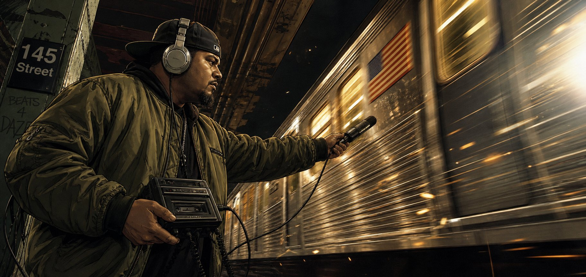

| Параметр съёмки | Режиссёрская и операторская спецификация |
| :--- | :--- |
| **Крупность и Ракурс** | Средний план (Medium Shot, MS), нижняя точка съёмки (Low Angle, уровень пояса) |
| **Оптика и Движение** | **35mm Anamorphic Prime (f/2.0)**. Медленный наезд (Dolly In) на профиль DJ Rusty Needle с лёгкой высокочастотной вибрацией камеры от проходящего поезда. |
| **Свет и Цвет** | Стробоскопический тёплый вольфрамовый свет (`3200K`) из мелькающих окон вагона бьёт по лицу героя и хромированной дужке наушников. Горизонтальный анаморфный блик справа. |
| **Действие в кадре** | **DJ Rusty Needle** на закрытой декорации стоит за защитной линией и записывает проходящий отдельным планом серебристый состав. Направленный микрофон, кассетный рекордер и профиль героя связываются монтажом; близость поезда создают оптика, световые перебивки и композитинг. |
| **Звук и Музыка (SFX)** | Гул станции, рельсовые транзиенты, механический щелчок `REC` в `00:03.25`, затем нарастание проходящего состава. В `00:15` — `STOP`; четыре коротких удара-сэмпла ведут в сцену 02. Полный бит пока не звучит. |

**Подробный покадровый сценарий:** [SCENE_01_SHOOTING_SCRIPT.md](SCENE_01_SHOOTING_SCRIPT.md) · **[Открыть интерактивный 18-секундный аниматик](scene_01.html).** Съёмка предполагается только на закрытой согласованной площадке; актёр и съёмочная группа не выходят в действующую железнодорожную зону.

---

### КАДР 02 // РОЖДЕНИЕ БИТА В КОТЕЛЬНОЙ (THE BOILER ROOM MPC)
* **Таймкод:** `00:18 – 00:42` (24 сек) • **Локация:** Подвальная студия-котельная под Бруклином

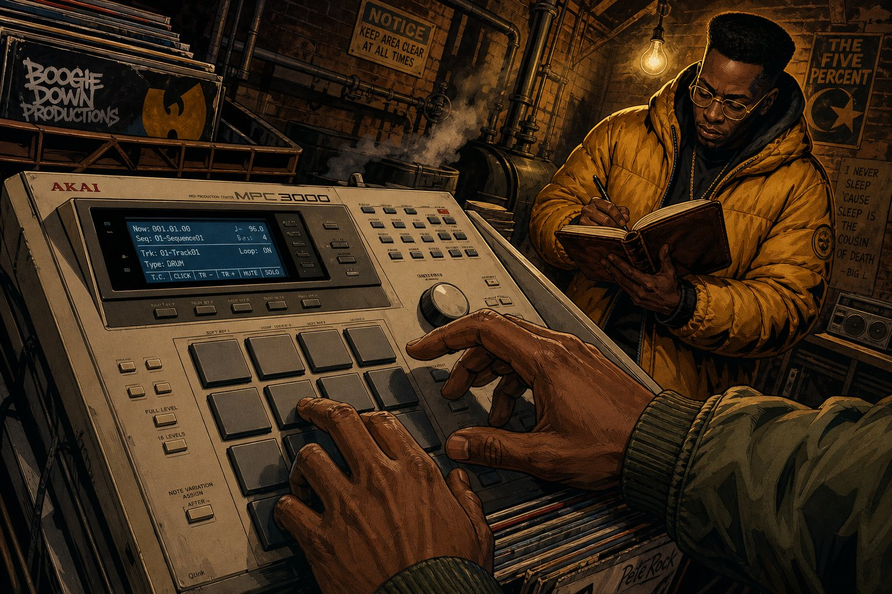

| Параметр съёмки | Режиссёрская и операторская спецификация |
| :--- | :--- |
| **Крупность и Ракурс** | Крупный план с глубиной резкости (Deep-Focus Close-Up), верхний ракурс под голландским углом (**Dutch Angle 15°**) |
| **Оптика и Движение** | **28mm Wide Prime (f/5.6)**. Резкий стартовый отъезд (Snap Zoom Out) от синего ЖК-экрана `AKAI MPC3000` к пальцам битмейкера, открывающий второй план. |
| **Свет и Цвет** | Качающаяся под потолком лампа накаливания на витом шнуре даёт жёсткий верхний янтарный свет. На переднем плане лицо и руки подсвечены холодным голубым свечением дисплея сэмплера (`Loop: ON / 96.0 -> 92.0 BPM`). |
| **Действие в кадре** | Пальцы **Rusty Needle** ритмично вколачивают нарезанный сэмпл поезда и пыльный джазовый аккорд в серые резиновые пэды MPC3000. На втором плане сквозь клубы пара из трубы **MC Kilo-Watt** в горчичном пуховике сосредоточенно вписывает рифмы в кожаный блокнот, качая головой в такт родившемуся биту. |
| **Звук и Музыка (SFX)** | Сухой щелчок метронома `1-2-3-4`, затем вступает тяжёлая пробивная бочка SP-1200, хрустящий снейр с виниловым песком и густой фанковый контрабас. |

---

### КАДР 03 // ПЕРВЫЙ КУПЛЕТ: ГОЛОС КВАРТАЛА (16MM FISHEYE CYPHER)
* **Таймкод:** `00:42 – 01:12` (30 сек) • **Локация:** Чугунная пожарная лестница в туманном переулке

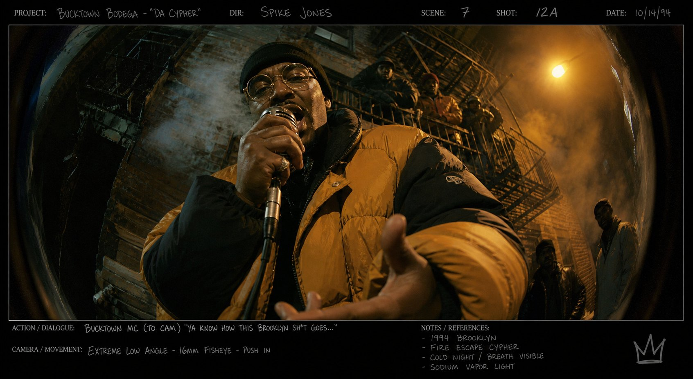

| Параметр съёмки | Режиссёрская и операторская спецификация |
| :--- | :--- |
| **Крупность и Ракурс** | Сверхкрупный / Средний деформированный план, экстремальный ракурс снизу вверх (**Worm’s-Eye View**) |
| **Оптика и Движение** | **8mm / 16mm Fisheye Lens** (культовый приём клипов Hype Williams и Busta Rhymes 90-х). Ручная живая камера (Handheld), качающаяся синхронно с речитативом артиста. |
| **Свет и Цвет** | Контровой жёлто-оранжевый фонарь сверху справа просвечивает клубы морозного пара изо рта MC. Тёплый заполняющий свет снизу от горящей бочки за кадром. |
| **Действие в кадре** | **Kilo-Watt** перегибается через перила пожарной лестницы прямо к линзе объектива, сжимая микрофон в правой руке, а левую выбрасывая вперёд в камеру, словно затягивая зрителя внутрь квартала. На верхних пролётах лестницы в полумраке качают силуэты остальных участников команды. |
| **Текст / Лирика** | *«Девяносто четвёртый, сталь поёт под землёй, / Мы пишем хроники ночи аэрозольной струёй...»* |

---

### КАДР 04 // ПРОНИКНОВЕНИЕ В ДЕПО (TRAIN YARD INFILTRATION)
* **Таймкод:** `01:12 – 01:35` (23 сек) • **Локация:** Закрытое депо отстоя поездов метро «Yard 5»

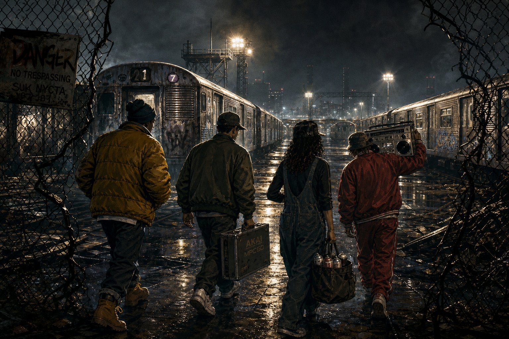

| Параметр съёмки | Режиссёрская и операторская спецификация |
| :--- | :--- |
| **Крупность и Ракурс** | Общий план со спины (Wide Cowboy Tracking Shot), камера на уровне плеч героев |
| **Оптика и Движение** | **35mm Anamorphic на Steadicam**. Камера плавно проходит сквозь разрезанную дыру в металлической сетке-рабице следом за четвёркой героев (проход сквозь обрамление — *Frame-within-a-Frame*). |
| **Свет и Цвет** | Высокие мачты прожекторов депо создают мощный контровой свет (Backlight) и длинные зеркальные отражения на мокром после дождя асфальте и маслянистых шпалах. |
| **Действие в кадре** | Вся команда **Subway Prophets** идёт плечом к плечу между рядами спящих стальных составов: слева **Kilo-Watt**, рядом **Rusty Needle** с алюминиевым кейсом `AKAI`, правее **Nova** с полной сумкой звенящих баллонов и **Gravity** с огромным хромированным бумбоксом на плече. |
| **Звук и Музыка (SFX)** | В бит вплетается металлический звон шариков внутри аэрозольных баллончиков (в такт хай-хэтам) и хруст гравия под подошвами Timberland и Adidas. |

---

### КАДР 05 // ЦВЕТНОЙ ВЗРЫВ: СТИЛЬ НА СТАЛИ (WILDSTYLE BOMBING)
* **Таймкод:** `01:35 – 02:02` (27 сек) • **Локация:** Между путями в депо, борт вагона №7249

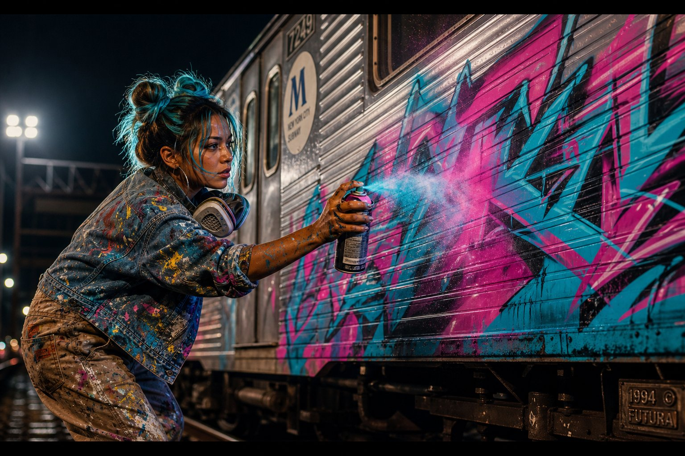

| Параметр съёмки | Режиссёрская и операторская спецификация |
| :--- | :--- |
| **Крупность и Ракурс** | Поясной профильный план (Medium Close-Up Profile), малая глубина резкости |
| **Оптика и Движение** | **50mm Prime (f/1.4)**. Динамический боковой трекинг на тележке (Lateral Dolly Track) параллельно движению руки художницы вдоль гофрированного борта вагона + резкие монтажные перебросы (Whip Pans). |
| **Свет и Цвет** | Холодный индустриальный прожектор слева работает как контровой свет (Rim Light), подсвечивая бирюзовые пучки волос **Nova** и облако неоново-розовой и голубой аэрозольной пыли в воздухе. |
| **Действие в кадре** | **Nova** с опущенным на шею респиратором в предельной концентрации ведёт быструю, острую как бритва линию контура (*outline*) баллоном с насадкой *Fat Cap*. На ребристой серебристой стали вагона прямо на глазах расцветает гигантский футуристический *Wildstyle*-кусок в цветах маджента и электрик-циан. |
| **Звук и Музыка (SFX)** | Ритмичное шипение аэрозоля (`ПШШ-ПШШ-ТСС!`) работает как перкуссионный брейк поверх скретчей DJ Rusty Needle. |

---

### КАДР 06 // ПРИПЕВ: ПОБЕДА НАД ГРАВИТАЦИЕЙ (AIRCHAIR FREEZE CYPHER)
* **Таймкод:** `02:02 – 02:30` (28 сек) • **Локация:** Центральный ангар депо перед расписанным вагоном

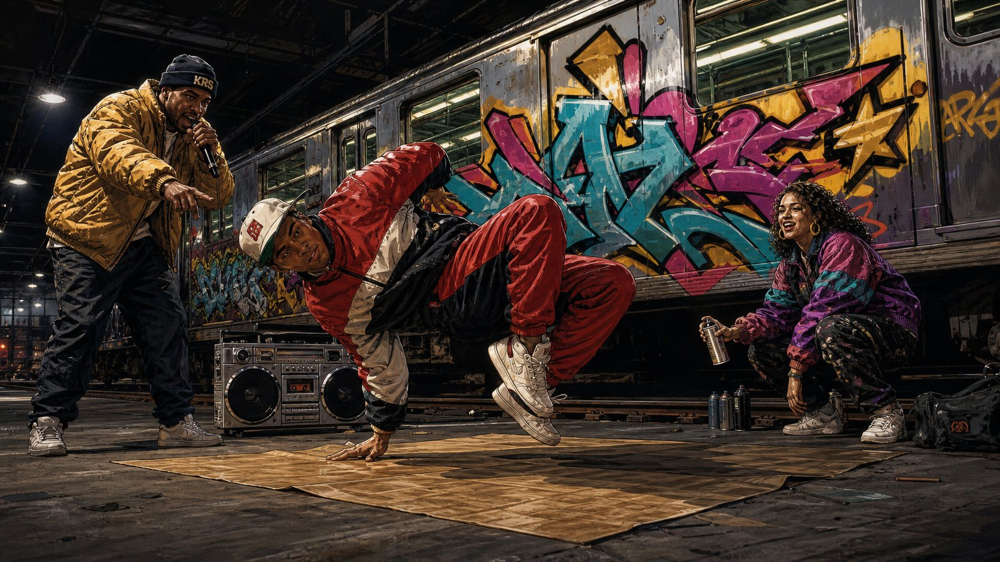

| Параметр съёмки | Режиссёрская и операторская спецификация |
| :--- | :--- |
| **Крупность и Ракурс** | Широкий общий план с нижней точки (Low-Angle Wide Shot, 20 см от пола) |
| **Оптика и Движение** | **24mm Wide Lens**. Круговой облет камеры по дуге 180° (Arc Shot) вокруг танцора. Эффект рваной покадровой печати плёнки (**Step-Printing / 12 fps shutter effect**) на входе во фриз, затем резкий стоп-кадр на удар снейра. |
| **Свет и Цвет** | Яркий направленный свет сверху выхватывает расстеленный на бетоне лист картона как театральную сцену. Свежая краска на вагоне позади переливается жёлтым, бирюзовым и пурпурным. |
| **Действие в кадре** | Кульминация припева! **B-Boy Gravity** после скоростного каскада *windmill* намертво замирает в сложнейшем одноруком балансе (**Airchair Freeze**) параллельно земле. Слева **Kilo-Watt** в прыжке раскачивает микрофон, справа **Nova** с баллоном в руке смеётся и поддерживает ритм, а у колёс вагона качает серебристый бумбокс. |
| **Звук и Музыка (SFX)** | Максимальная плотность аранжировки: хоровой рефрен всей команды, духовая секция (сэмпл саксофона) и реверберирующий удар бочки в момент фиксации фриза. |

---

### КАДР 07 // САСПЕНС: ЛУЧ ФОНАРЯ ОХРАНЫ (SPLIT-DIOPTER SUSPENSE)
* **Таймкод:** `02:30 – 02:50` (20 сек) • **Локация:** Под днищем вагона метро / пути депо

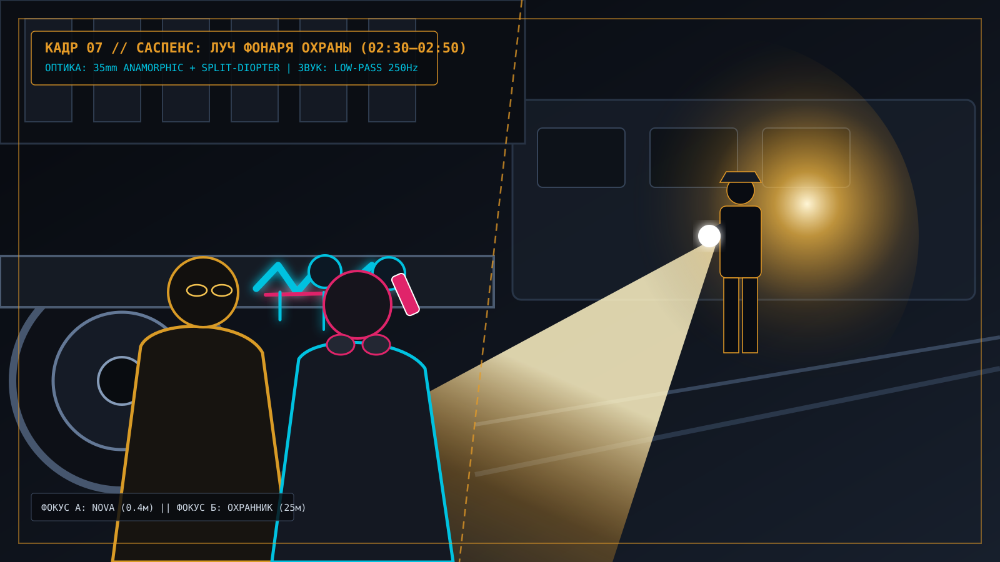

> *Примечание продакшна: Выше представлена режиссёрская схема композиции со сплит-диоптрией (Split-Diopter). Поскольку в текущем ходу был достигнут системный лимит в 10 AI-иллюстраций (4 полноростовых концепта персонажей + 6 ключевых кадров), фотореалистичный AI-рендер для кадров 07 и 08 можно сгенерировать следующим сообщением.*

| Параметр съёмки | Режиссёрская и операторская спецификация |
| :--- | :--- |
| **Крупность и Ракурс** | Двухплановая композиция со сплит-диоптрией (**Split-Diopter Lens** — как в классических триллерах Брайана Де Пальмы) |
| **Оптика и Движение** | **35mm Anamorphic + Split-Diopter насадка**. Абсолютно статичная затаившаяся камера на уровне рельсов: одновременно в звенящей резкости находятся лицо **Nova** в 40 см от объектива (слева) и фигура ночного охранника в 25 метрах позади (справа). |
| **Свет и Цвет** | Глубокая холодная тень под вагоном (`5600K`) контрастирует с ослепительным конусом луча фонаря охранника, который скользит по стальным колёсам и свежим каплям бирюзовой краски на шпалах. |
| **Действие в кадре** | Команда затаилась за чугунной колёсной тележкой вагона. Пока луч фонаря проходит в сантиметрах от их кроссовок, **Nova** с дерзкой хулиганской ухмылкой ставит финальный автограф маркером-сквизером `PROPHETS '94` на тормозной колодке и прикладывает палец к губам, глядя прямо в камеру. |
| **Звук и Музыка (SFX)** | Бит внезапно уходит под воду через глухой **Low-Pass фильтр (срез частот до 250 Hz)**. Слышны только гулкое сердцебиение, треск рации охранника и шипение капли краски на металле. |

---

### КАДР 08 // ФИНАЛ: РАССВЕТНЫЙ САЙФЕР И ПОЕЗД В ГОРОД (DAWN ROOFTOP FINALE)
* **Таймкод:** `02:50 – 03:20` (30 сек) • **Локация:** Крыша старого кирпичного дома напротив надземной эстакады метро

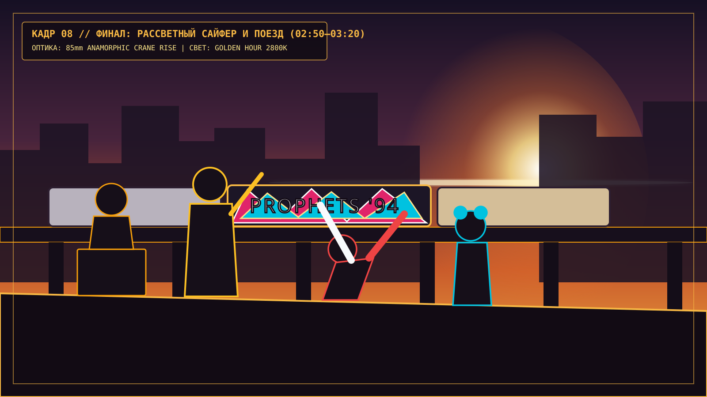

| Параметр съёмки | Режиссёрская и операторская спецификация |
| :--- | :--- |
| **Крупность и Ракурс** | Переход со среднего плана на эпический панорамный общий план (Extreme Wide Shot, EWS) |
| **Оптика и Движение** | **85mm Telephoto Anamorphic на операторском кране (Technocrane)**. Камера поднимается из-за спин четырёх друзей, сидящих на парапете крыши, открывая величественную панораму просыпающегося Бруклина и стальной эстакады метро. |
| **Свет и Цвет** | **Golden Hour (Золотой час рассвета, 2800K)**. Ослепительное утреннее солнце встаёт между небоскрёбами, заливая кирпичные крыши и клубы утреннего пара золотым контровым светом. |
| **Действие в кадре** | На переднем плане **Kilo-Watt**, **Rusty Needle**, **Nova** и **Gravity** сидят на краю крыши, свесив ноги и передавая друг другу термос и наушники. По эстакаде перед ними на полном ходу проносится утренний пассажирский поезд — и посреди серебристого состава горит в лучах восходящего солнца их гигантский цветной вагон **«SUBWAY PROPHETS»**, который видят тысячи просыпающихся жителей города. |
| **Звук и Музыка (SFX)** | Финальное скретч-соло **Rusty Needle**, тёплый духовой сэмпл уходит в долгий дилей, и под уютный треск виниловой иглы в конце дорожки кадр плавно уходит в тёмное поле (**Fade to Black**). |

---

## 5. ТЕХНИЧЕСКАЯ ТАБЛИЦА ПРОДАКШНА (SHOT LIST SUMMARY)

| № | Сцена | Таймкод | Длит. | Персонажи в кадре | Объектив | Движение камеры | Ключевой свет |
| :-: | :--- | :---: | :---: | :--- | :---: | :--- | :--- |
| **01** | Интро: Охота за звуком | `00:00–00:18` | 18 с | Rusty Needle | 35mm Anamorphic | Dolly In + Train Shake | Стробоскоп из окон вагона (3200K) |
| **02** | Рождение бита в котельной | `00:18–00:42` | 24 с | Rusty Needle, Kilo-Watt | 28mm Prime | Overhead Dutch 15° + Snap Zoom | Лампа накаливания + экран MPC |
| **03** | Первый куплет (Пожарная лестница) | `00:42–01:12` | 30 с | Kilo-Watt (+ команда) | 16mm Fisheye | Extreme Low Angle Handheld | Натриевый фонарь + морозный пар |
| **04** | Проникновение в депо | `01:12–01:35` | 23 с | Вся команда (4 героя) | 35mm Anamorphic | Steadicam Follow Shot | Контровые мачты прожекторов депо |
| **05** | Бомбинг вагона (Wildstyle) | `01:35–02:02` | 27 с | Nova | 50mm f/1.4 | Lateral Dolly + Whip Pan | Холодный Rim Light сквозь аэрозоль |
| **06** | Припев: Фриз Гравитации | `02:02–02:30` | 28 с | Gravity, Kilo-Watt, Nova | 24mm Wide | 180° Arc Shot + Step-Printing | Верхний спот + рефлекс от граффити |
| **07** | Саспенс: Луч фонаря охраны | `02:30–02:50` | 20 с | Nova, Kilo-Watt (+ Охранник) | 35mm Split-Diopter | Static Low-Level Rail Shot | Луч фонаря в тумане + глубокая тень |
| **08** | Финал: Рассветный поезд на эстакаде | `02:50–03:20` | 30 с | Вся команда (4 героя) | 85mm Anamorphic | High Crane Rise (Jib Up) | Золотой час рассвета (Golden Flare) |
