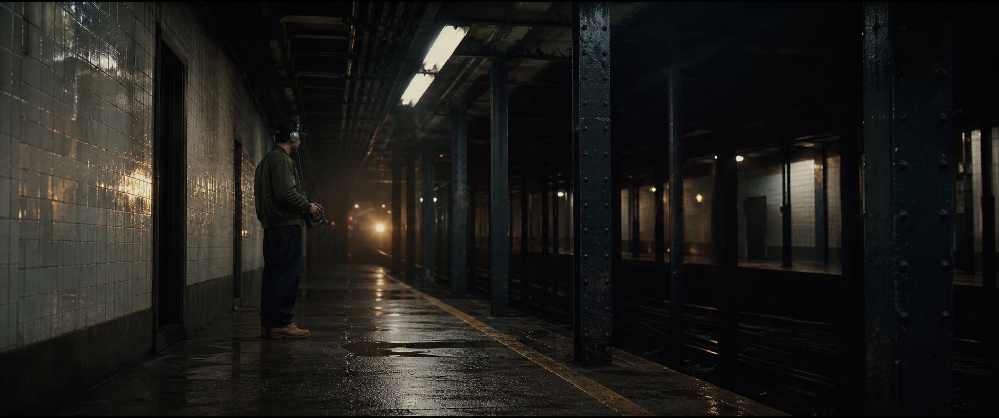
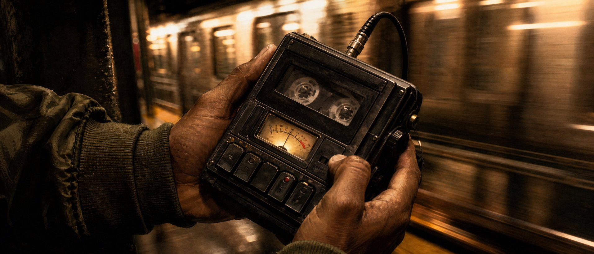
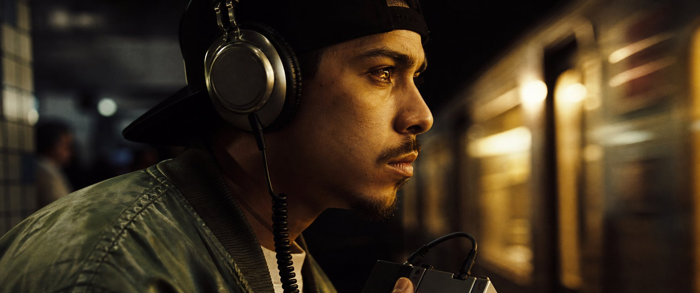

# СЦЕНА 01 — «ОХОТА ЗА ЗВУКОМ»
## Покадровый сценарий и режиссёрский лист

**Проект:** *SUBWAY PROPHETS — «Последний вагон до рассвета»*  
**Сцена:** 01 / интро / *Subway Sound Hunt*  
**Хронометраж:** 00:00–00:18 · ровно 18 секунд · 432 кадра при 24 fps  
**Локация по сюжету:** платформа 145th Street, Нью-Йорк, ночь, 1994 год  
**Персонаж:** DJ Rusty Needle (Дарио Моралес), битмейкер команды  
**Формат:** 2.39:1, 24 fps, визуальная эмуляция 35-мм негатива 500T  
**Музыка:** бита ещё нет; городской шум становится первым сэмплом. Полный Boom-Bap 92 BPM входит в сцене 02.

> Это режиссёрский аниматик: концепт-кадры сведены в 18-секундную последовательность с имитацией движения камеры и оригинальным синтетическим звуковым скетчем. Это не финальная съёмка и не live-action мастер.

## Драматургическая задача

За 18 секунд показать, что Rusty умеет **слышать музыкальную форму внутри города**. Не объяснять это репликой: дать зрителю пройти путь от пустой платформы к найденному ритму. Сцена работает как пролог к рождению бита в котельной: шум поезда записан, выбран и передан следующему эпизоду.

**Игровая задача:** Rusty не изображает восторг. Его внимание направлено на звук; единственный знак узнавания — почти незаметный кивок на повторе колёсного стыка.  
**Диалог:** отсутствует.  
**Музыка:** отсутствует до перехода в сцену 02.  
**Финальный звуковой мост:** щелчок STOP, короткая пауза, четыре удара-сэмпла с интервалом около 0,65 секунды; следующий монтажный кадр раскрывает MPC3000.

## Покадровая экспликация

| № | Таймкод / длительность | Крупность, оптика | Камера и свет | Действие | Звук / монтаж |
| :-: | :--- | :--- | :--- | :--- | :--- |
| **01A** | `00:00.00–00:03.25` · 3,25 с · 78 кадров | Общий establishing, 24mm Anamorphic | Очень медленный dolly-in на 0,8 м; холодный флуоресцентный верх, едва заметное янтарное свечение из туннеля | Длинная перспектива станции 145th Street. Rusty ждёт с рекордером за безопасной линией платформы; точка света приближается | Низкий гул тоннеля, тонкий треск лампы, дальняя вибрация рельсов. **L-cut** гула ведёт в деталь рекордера |
| **01B** | `00:03.25–00:06.00` · 2,75 с · 66 кадров | Деталь рук и рекордера, 85mm Macro | Почти неподвижная макрокамера; rack focus с кнопки на стрелку VU | Большой палец нажимает REC. Катушки начинают вращаться; индикатор «просыпается» | Сухой механический щелчок в `00:03.25`, запуск мотора и тонкий tape hiss. Резкая склейка на вход состава |
| **01C** | `00:06.00–00:12.00` · 6 с · 144 кадра | Средний план снизу, 35mm Anamorphic f/2.0 | Медленный dolly-in и лёгкая высокочастотная вибрация; мелькающий вольфрамовый свет 3200K, один горизонтальный flare | Rusty вытягивает направленный микрофон к звуковому полю проходящего состава. Он сохраняет безопасную позицию; движение поезда выполняется отдельным планом/композитингом | Воздух поезда нарастает, рельсовые стыки дают неровные транзиенты, короткий металлический визг. Уровень кассетной записи поднимается к красной зоне |
| **01D** | `00:12.00–00:15.00` · 3 с · 72 кадра | Профильный крупный план, 85mm Close-Up | Микроподъезд и выдержанная пауза; полосы отражения проходят по глазу и чашке наушника | Грохот отдаляется. Rusty различает повторяющийся рисунок и едва заметно кивает | Шум уходит по стереополю вправо; остаётся короткий хвост ритма. На взгляде — микропаузa перед STOP |
| **01E** | `00:15.00–00:18.00` · 3 с · 72 кадра | Чёрный графический кадр / sound bridge | Жёсткая склейка в чёрное; янтарная тонкая линия уровня, затем титр `SAMPLE CAPTURED` | Палец нажимает STOP за кадром. Найденный рисунок на секунду превращается в четыре сухих удара | Щелчок STOP в `00:15.00`; короткая пауза; четыре удара около `15.60 / 16.25 / 16.90 / 17.55`. Склейка в следующую сцену на `00:18.00` |

### Визуальные панели

#### 01A — Платформа просыпается

#### 01B — Нажать REC

#### 01C — Город записывает бит

#### 01D — Услышать рисунок

#### 01E — Зафиксировать сэмпл

Чёрное поле. Малый титр в нижней трети: `145TH STREET · TAKE 01`. На последнем ударе — `SAMPLE CAPTURED`, затем монтажный переход в пар котельной сцены 02.

## Звук и монтажная партитура

| TC | Событие | Микс / монтаж |
| :--- | :--- | :--- |
| `00:00` | Тоннельный гул и воздух станции | Низкочастотная основа тихая, широкий, но почти моноцентричный образ |
| `00:02` | Дальний свет / проходной состав приближается | Медленный рост саб-низа и воздуха, без музыкальной сетки |
| `00:03.25` | Нажатие REC | Сухой близкий механический транзиент; старт тихого шороха ленты |
| `00:06–00:12` | Состав проходит кадр | Стереопроход слева направо; ритм колёс неровный и органичный, без драматизации опасности |
| `00:12–00:15` | Rusty слушает и выбирает момент | Поезд уходит вправо; оставить среднечастотный хвост, не подкладывать бит |
| `00:15.00` | Нажатие STOP | Щелчок отделён от хвоста записи; почти мгновенное падение амбиенса |
| `00:15.60–00:17.55` | Четыре удара из найденного материала | Акценты раз в ~0,65 с намекают на 92 BPM; не превращать их в готовую драм-партию |
| `00:18.00` | Вход в сцену 02 | Котельная и первый удар MPC становятся началом полного грува |

**Звуковой файл:** [scene_01_soundscape.wav](assets/scene_01_soundscape.wav) · 18 секунд · стерео 22,05 kHz · оригинальный синтезированный фоли-скетч без сторонних записей.  
**Исходник генератора:** [render_scene_01_soundscape.py](scripts/render_scene_01_soundscape.py).

## Арт-дирекшн и непрерывность

- **Палитра:** чёрный асфальт и холодный зелёно-серый кафель; натриевый янтарь `#E59B27`; сталь состава `#7A8494`; оливковый бомбер Rusty `#4A5535`.
- **Фактура:** лёгкое зерно, мягкая гало-ореолация горячих окон, глубокие чёрные без клиппинга деталей одежды.
- **Реквизит:** портативный кассетный рекордер, направленный микрофон, кабель, закрытые наушники. Никакой видимой маркировки, которую нужно точно воспроизводить в каждом плане.
- **Матч-кат:** красная зона VU → импульсы света в окнах состава → синий дисплей MPC в сцене 02.
- **Сохранить:** один и тот же оливковый MA-1, чёрная кепка назад, серебряные наушники, короткая борода; рекордер остаётся в руках Rusty до нажатия STOP.

## Безопасность и постановка

Снимать только на закрытой согласованной платформе или декорации. Актёр, камера, микрофонная удочка и кабели остаются за защитной линией; в действующую железнодорожную зону никто не выходит. Движение состава снять отдельно с разрешённой позиции или создать композитингом. Визуальная близость поезда достигается оптикой, параллаксом, световыми перебивками и монтажом, а не опасным расположением исполнителя.

## Интерактивный просмотр

[Открыть аниматик сцены 01](scene_01.html) · [Вернуться к полной раскадровке](index.html).
